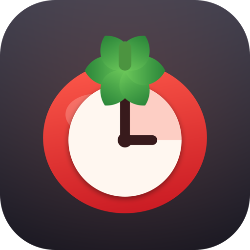
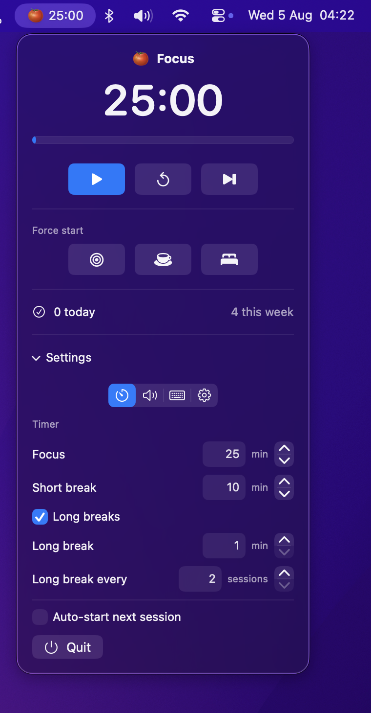

<p align="center">
  
</p>

<h1 align="center">Pomodoro</h1>

<p align="center">
  A native macOS menu bar Pomodoro timer.<br>
  SwiftUI, no dependencies, no Dock icon.
</p>

<p align="center">
  <a href="https://github.com/kossa/pomodoro/releases/latest"></a>
  
  
</p>

- 🍅 Live countdown in the menu bar
- ⌨️ Global shortcuts (no Accessibility permission)
- 🔄 Auto-updates from GitHub
- 📊 Daily & weekly statistics
- ⚡ Native SwiftUI, zero dependencies

<p align="center">
  
</p>

## Features

- Live countdown in the menu bar, its emoji following the phase — show or hide the
  tomato, the minutes and the seconds independently. Hide all three and the item goes
  blank but stays clickable, leaving notifications as the cue.
- Settings split into **Timer / Sounds / Shortcuts / General** tabs, so the popover
  stays short
- Configurable focus / short break / long break lengths and long-break interval —
  type a value directly or use the stepper
- **Long breaks can be turned off** entirely — then every break is a short one
- **A different chime per phase** — pick any system sound (or none) for the end of a
  focus session, a break, and a long break, with a preview button
- **Global shortcuts** for start/pause, force focus, and force break — registered through
  Carbon, so no Accessibility permission is needed. Default: <kbd>⌃⌥Space</kbd> toggles the
  timer. A shortcut another app already owns is flagged with a warning triangle.
- Auto-start the next session (toggleable)
- **Force start** — jump straight into a focus or break at any point in the cycle
- Daily and weekly completed-session counts, kept for 30 days
- **Self-updating** — checks GitHub once a day (or on demand), then downloads,
  verifies and installs the new version in place

## How it compares

| Feature | Pomodoro | Other menu bar timers |
| --- | :---: | :---: |
| Native SwiftUI | ✅ | Varies |
| No Dock icon | ✅ | ❌ |
| No Accessibility permission | ✅ | ❌ |
| Self-updating | ✅ | Varies |
| Zero dependencies | ✅ | ❌ |

## Install

Grab the [latest release](https://github.com/kossa/pomodoro/releases/latest), or paste this:

```sh
curl -L -o /tmp/Pomodoro.zip https://github.com/kossa/pomodoro/releases/latest/download/Pomodoro.zip
ditto -x -k /tmp/Pomodoro.zip /Applications
xattr -dr com.apple.quarantine /Applications/Pomodoro.app   # ad-hoc signed, not notarized
open /Applications/Pomodoro.app
```

`ditto` rather than `unzip`: it unpacks macOS bundles without leaving `._*` files
behind, which would otherwise invalidate the app's code signature.

Requires macOS 14 or later, Apple silicon. `Pomodoro.zip` always points at the newest
version; each release also carries a version-stamped copy.

### Build from source

Needs the Swift toolchain — the Command Line Tools are enough.

```sh
./scripts/build-app.sh     # produces ./Pomodoro.app
./scripts/install.sh       # copies it to /Applications and launches it
./scripts/release.sh 1.1.0 # tag, build and publish a GitHub release
```

`Package.swift` is included for building with a full Xcode install. The build script
compiles with `swiftc` directly, because the SwiftPM manifest library shipped with the
Command Line Tools is version-mismatched and cannot compile the manifest.

The app is ad-hoc signed rather than notarized, which is why the `xattr` step above is
needed after downloading. Built locally, it just runs.

## Launch at login

System Settings → General → Login Items → **+** → `/Applications/Pomodoro.app`.

## Layout

| File | Role |
| --- | --- |
| `Sources/Pomodoro/PomodoroApp.swift` | `MenuBarExtra` scene, menu bar title |
| `Sources/Pomodoro/TimerEngine.swift` | Session state; countdown derived from an absolute end date so it survives sleep |
| `Sources/Pomodoro/Phase.swift` | Focus / short break / long break |
| `Sources/Pomodoro/Settings.swift` | Preferences (`@AppStorage`) |
| `Sources/Pomodoro/Stats.swift` | Per-day completed focus counts |
| `Sources/Pomodoro/Notifier.swift` | Notification + chime, with an `osascript` fallback |
| `Sources/Pomodoro/SoundLibrary.swift` | System alert sounds, discovered at runtime |
| `Sources/Pomodoro/HotKeys.swift` | Global shortcut bindings and Carbon registration |
| `Sources/Pomodoro/ShortcutRecorder.swift` | Click-to-record shortcut field |
| `Sources/Pomodoro/Updater.swift` | Release checks and the in-place update |
| `Sources/Pomodoro/MenuView.swift` | The popover UI and its settings tabs |

## Icon

`Resources/AppIcon.icns` is generated, not hand-drawn — `swift scripts/make-icon.swift`
redraws every size from code. Edit the drawing in that script to change the icon.

## License

MIT — see [LICENSE](LICENSE).
